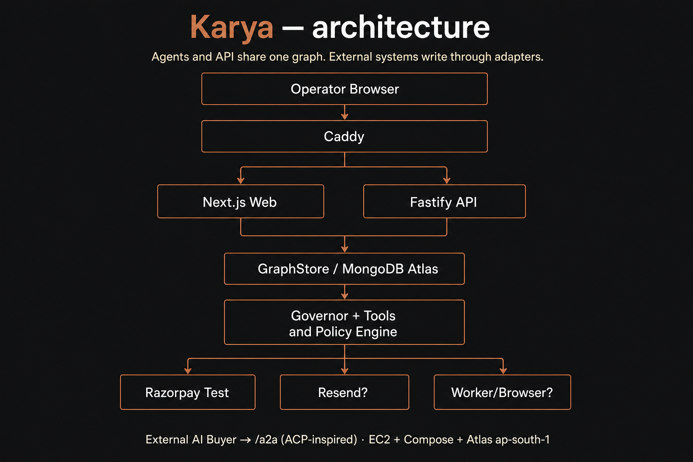

# Karya

**The graph is the memory of the business. Agents are the operators. The human is the governor.**

Karya is an agentic ERP for a one-person Indian commerce company — built for Razorpay Track 01 so a merchant is operable by humans *and* sellable to an AI buyer.

## Demo

**URL:** _TBD — set after EC2 + Atlas deploy_ (`https://…` or `http://<elastic-ip>`)

Open the console; Arka Atelier data is **pre-seeded**. No login yet (auth lands later). Operator identity in seed: `anika@arka.atelier`.

## Pitch video

**5-minute video:** _TBD — YouTube unlisted link after recording_

Script: [`docs/demo/pitch-script.md`](docs/demo/pitch-script.md) · Judge walkthrough: [`docs/demo/DEMO.md`](docs/demo/DEMO.md)

## Architecture



```
[Operator Browser] → [Caddy] → [Next.js Web] + [Fastify API]
                                      ↓
                              [GraphStore / MongoDB Atlas]
                                      ↓
                    [Governor + Tools] ← [Policy Engine]
                                      ↓
              [Razorpay Test]  [Resend?]  [Worker/Browser?]
                                      ↓
                              [External AI Buyer → /a2a]
```

*Agents and API share one graph. External systems write through adapters.*

Vector source for the slide: [`docs/demo/architecture.svg`](docs/demo/architecture.svg) (export to `architecture.png` for the pitch).

## Stack

- **Language:** TypeScript 5.8, strict, Node.js 22
- **Frontend:** Next.js 15 App Router, Tailwind, XYFlow (React Flow) — owned primitives, not a generic dashboard kit
- **API:** Fastify 5 (`apps/api`) — Next.js does not own business routes
- **DB:** MongoDB 8 — local Docker; production = Atlas on AWS `ap-south-1`
- **Agents:** Vercel AI SDK tool loop; Governor + specialists
- **Queue:** MongoDB-backed jobs (no Redis in MVP)
- **Email:** Comms adapter writes a `Message` node; Resend when `RESEND_API_KEY` is set
- **Browser:** Playwright allowlisted fetch with **seeded directory fallback** (not live web scraping as the demo path)
- **Deploy (Buildathon):** EC2 + Docker Compose + Caddy in `ap-south-1` (ECS Fargate + ALB is the documented v1 upgrade — see [`infra/README.md`](infra/README.md))

## Razorpay integration

- **Test mode only** — `rzp_test_*` keys. Not production settlement.
- **Payment Links** + Orders for inbound collect; webhooks at `/v1/webhooks/razorpay`
- Idempotency keys on Razorpay calls
- **Payouts:** `PayoutAdapter` interface. MVP ships `LedgerPayoutProvider` (writes `Payment` nodes, no bank). If `RAZORPAYX_KEY_ID` is set, `RazorpayXProvider` can be swapped in — we do **not** claim live bank payouts in this demo
- Inbound money is always a real Razorpay **test-mode** Payment Link — we do not fake collect

## Agent-to-agent commerce

ACP-**inspired**, **not** ACP-certified / not OpenAI ACP or NPCI UAP compliant.

| Endpoint | Role |
|---|---|
| `GET /a2a/catalog` | Agent-readable catalog (products, offer, availability) |
| `POST /a2a/checkout` | Checkout session → SalesOrder + Razorpay test Payment Link + stock reserve |

We implemented the merchant-side shape those protocols need, settled on Razorpay test mode.

## Local development

```bash
# Mongo
docker compose up -d

# Env
cp .env.example .env
# Fill RAZORPAY_* (test), optional OPENAI_API_KEY / RESEND_API_KEY

# Install & run
pnpm install
pnpm dev
# Web http://localhost:3000  ·  API http://localhost:4000
```

First console load can seed via `POST /v1/admin/seed` in development. See `.env.example` for all variables.

## Production deploy

Primary path: **EC2 + Docker Compose + Caddy** + **MongoDB Atlas** (`ap-south-1`).

```bash
cp .env.production.example .env.production
# Edit MONGO_URL, PUBLIC_URL / WEB_ORIGIN, Razorpay test keys, OpenAI

# One-time Atlas seed (from a trusted machine)
MONGO_URL='mongodb+srv://…' pnpm exec tsx scripts/deploy/seed-production.ts

docker compose -f docker-compose.prod.yml --env-file .env.production up -d --build
bash scripts/deploy/health-check.sh
```

Step-by-step for judges and operators: [`docs/demo/DEMO.md`](docs/demo/DEMO.md).  
CI: `.github/workflows/ci.yml`. Manual deploy: `.github/workflows/deploy.yml` (secrets `EC2_HOST`, `EC2_SSH_KEY`, `EC2_USER`).

### Tear-down

1. Stop Compose or terminate the EC2 instance; release Elastic IP if unused  
2. Remove Atlas IP allowlist / pause the cluster  
3. Rotate Razorpay test key + webhook secret  
4. Clear GitHub deploy secrets when the demo window ends  

## What we did not build

- A Tally / Shopify / SAP replacement  
- Unattended browser posting to real marketplaces  
- Live bank payouts in production  
- Training our own model  
- Multi-tenant billing for Karya itself  
- Pixel-perfect mobile (console targets ≥1280px; usable at 768px)  
- Letting the LLM invent graph schema  
- Full ACP / UCP / AP2 / x402 certification  

## License

MIT
